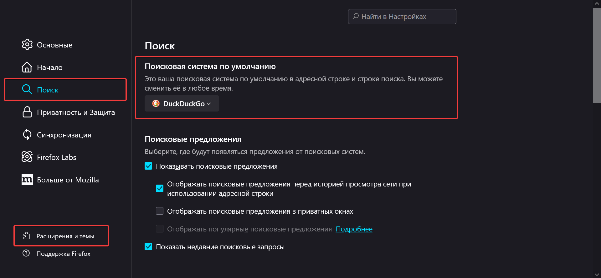
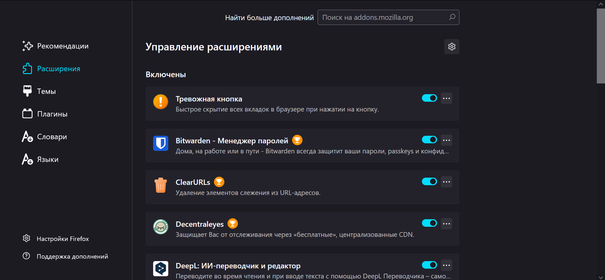
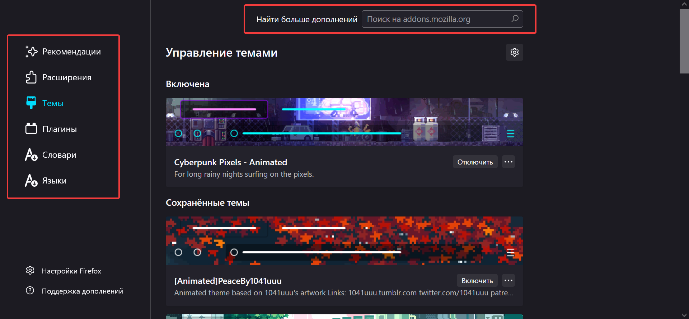

# Useful-apps-for-Windows
описание описание описание


## FireFox (Браузер):
Это бесплатный веб-браузер с открытым исходным кодом, разработанный компанией Mozilla. Он предлагает пользователям высокую степень конфиденциальности, блокируя трекеры и обеспечивая защиту от вредоносных сайтов. Кроме того, Firefox поддерживает множество расширений, позволяющих настраивать функциональность браузера под индивидуальные потребности.

1. Обзоры браузера (YouTube):
    - ["Выбираем лучший браузер"](https://www.youtube.com/watch?v=ZV2TvYNmkYE) Honey Montana
    - ["Прокачиваем браузер на максимум"](https://www.youtube.com/watch?v=r5w8P15tFw4&t=310s) Honey Montana
2. Скачать браузер:
    - [Microsoft Store Windows](https://apps.microsoft.com/detail/9NZVDKPMR9RD?hl=ru&gl=RU&ocid=pdpshare)
    - [Official site Mozilla](https://www.mozilla.org/ru/firefox/new/)
3. Выбираем поисковую систему. DuckDuckGo — это поисковик, который обеспечивает анонимность пользователей, не отслеживает их действия и не показывает рекламу, предлагая чистые и непредвзятые результаты поиска (`Настройки` --> `Поиск` --> `Поисковая система по умолчанию`):
      
4. Расширения для брузера (`Настройки` --> `Расширения и темы` --> `Расширения`):
   
    - [I Still Don't Care About Cookies](https://addons.mozilla.org/ru/firefox/addon/istilldontcareaboutcookies/?utm_source=addons.mozilla.org&utm_medium=referral&utm_content=search) :no_bell::x::mag: — это расширение для браузеров автоматически скрывает уведомления о cookie на веб-сайтах, позволяя пользователям просматривать контент без отвлекающих факторов и обеспечивая конфиденциальность.
    - [I Don't Care About Cookies](https://addons.mozilla.org/ru/firefox/addon/i-dont-care-about-cookies/) :no_bell::x::mag: — это расширение для браузеров автоматически скрывает уведомления о cookie на веб-сайтах, упрощая просмотр контента и помогая пользователям избежать постоянного закрытия или согласия с этими уведомлениями.
    - [Disconnect](https://addons.mozilla.org/en-US/firefox/addon/disconnect/) :x::mag: — это мощное расширение для браузеров, которое блокирует трекеры, используемые крупными компаниями, такими как Google, Facebook и Twitter, обеспечивая защиту конфиденциальности пользователей.
    - [Privacy Badger](https://addons.mozilla.org/ru/firefox/addon/privacy-badger17/?utm_source=addons.mozilla.org&utm_medium=referral&utm_content=search) :x::mag: — это расширение для браузеров, которое автоматически блокирует трекеры, следящие за пользователями в интернете.
    - [Decentraleyes](https://addons.mozilla.org/ru/firefox/addon/decentraleyes/?utm_source=addons.mozilla.org&utm_medium=referral&utm_content=search) :x::mag: — это расширение для браузеров, которое помогает защитить конфиденциальность пользователей, подменяя запросы к общим CDN (Content Delivery Networks) локальными копиями библиотек.
    - [uBlock Origin](https://addons.mozilla.org/ru/firefox/addon/ublock-origin/) — это мощное расширение для блокировки рекламы и трекеров, которое улучшает скорость загрузки страниц и защищает конфиденциальность пользователей, позволяя добавлять пользовательские фильтры для эффективной блокировки нежелательного контента.
    - [WebGL Fingerprint Defender](https://addons.mozilla.org/ru/firefox/addon/webgl-fingerprint-defender/?utm_source=addons.mozilla.org&utm_medium=referral&utm_content=search) :x::mag: — это расширение для браузеров защищает пользователей от отслеживания с помощью технологии WebGL, предотвращая сбор данных о графических характеристиках устройства и уменьшая риск создания уникальных отпечатков.
    - [Font Fingerprint Defender](https://addons.mozilla.org/ru/firefox/addon/font-fingerprint-defender/?utm_source=addons.mozilla.org&utm_medium=referral&utm_content=search) :x::mag: — это расширение для браузеров защищает пользователей от отслеживания с помощью технологии отпечатков шрифтов, предотвращая сбор информации о шрифтах на устройстве и повышая конфиденциальность при серфинге в интернете.
    - [DeepL переводчик](https://addons.mozilla.org/ru/firefox/addon/deepl-translate/?utm_source=addons.mozilla.org&utm_medium=referral&utm_content=search) :globe_with_meridians: — это мощный ИИ-переводчик и редактор, использующий нейронные сети для высококачественного перевода текстов на множество языков, с интуитивно понятным интерфейсом и возможностью перевода выделенного текста.
    - [Simple Translate](https://addons.mozilla.org/ru/firefox/addon/simple-translate/?utm_source=addons.mozilla.org&utm_medium=referral&utm_content=search) :globe_with_meridians: — это расширение для браузеров, которое позволяет пользователям быстро и удобно переводить текст на разные языки прямо на веб-страницах, используя Google Переводчик и DeepL.
    - [Bitwarden](https://addons.mozilla.org/ru/firefox/addon/bitwarden-password-manager/) :key: — это бесплатный менеджер паролей, который безопасно хранит, генерирует и управляет паролями, предлагая шифрование данных и синхронизацию между устройствами на различных платформах.
    - [Panic Button](https://addons.mozilla.org/ru/firefox/addon/panic-button/) :x::mag:— это расширение для браузера Firefox, которое позволяет пользователям скрывать открытые вкладки и окна одним нажатием кнопки.
    - [Adaptive Tab Bar Colour](https://addons.mozilla.org/ru/firefox/addon/adaptive-tab-bar-colour/) — это расширение для браузера Firefox, которое изменяет цвет панели вкладок в зависимости от цвета текущей веб-страницы.
    - [РуТрекер](https://addons.mozilla.org/ru/firefox/addon/rutracker-add-on/?utm_content=addons-manager-reviews-link&utm_medium=firefox-browser&utm_source=firefox-browser) :satellite: — это официальный плагин от RuTracker.org, который предоставляет доступ к контенту на торрент-трекере и позволяет обходить блокировки, обеспечивая доступ к запрещенным сайтам на территории РФ.
    - [Dark Reader](https://addons.mozilla.org/ru/firefox/addon/darkreader/?utm_content=addons-manager-reviews-link&utm_medium=firefox-browser&utm_source=firefox-browser) — это расширение для браузеров, которое позволяет пользователям включать темный режим на веб-сайтах, улучшая комфорт чтения в условиях низкой освещенности.
    - [URL Shortener & QR Code - iShortener](https://addons.mozilla.org/ru/firefox/addon/ishortener/?utm_content=addons-manager-reviews-link&utm_medium=firefox-browser&utm_source=firefox-browser) :link: — это расширение для браузеров, которое позволяет пользователям быстро сокращать длинные URL-адреса и генерировать QR-коды для удобного обмена ссылками.
    - [ClearURLs](https://addons.mozilla.org/ru/firefox/addon/clearurls/?utm_source=addons.mozilla.org&utm_medium=referral&utm_content=search) :link: — это расширение для браузеров, которое автоматически удаляет лишние параметры отслеживания из URL-адресов, когда пользователи переходят по ссылкам.
5. Оформление браузера (`Настройки` --> `Расширения и темы` --> `Темы`):
   
    - [Оформление домашней станицы](https://firefoxcss-store.github.io/)
    - [Оформление шапки](https://addons.mozilla.org/ru/firefox/themes/?utm_source=firefox-browser&utm_medium=firefox-browser&utm_content=find-more-link-bottom) браузера: панели вкладок и инструментов
    - [Дополнительные пакеты языков](https://addons.mozilla.org/ru/firefox/language-tools/)
6. В адресной\поисковой строке пишете `about:support` (открытие и просмотр полных харатеристик браузера) --> Находите `Папка профиля` --> Нажимаете на кнопку `Открыть папку` --> Находите файл `pref.js` --> Открываете файл для редоктирования --> В конец файла `pref.js` вставляете код, который находится ниже --> Сохраняете и перезапускаете FireFox: 
    ``` javascript
    // Отключаем Pocket
    user_pref("extensions.pocket.api", "");
    user_pref("extensions.pocket.enabled", false);
    user_pref("extensions.pocket.site", "");
    user_pref("extensions.pocket.oAuthConsumerKey", "");
    
    //Отключаем анимацию открытия видео на фуллскин и подсказку "нажмите esc.."
    //Сайты могут отслеживать переход в полноэкранный режим с помощью JavaScript,
    //аналитики или видео-плееров, чтобы собирать данные о поведении пользователя
    user_pref("full-screen-api.transition-duration.enter", "0");
    user_pref("full-screen-api.transition-duration.leave", "0");
    user_pref("full-screen-api.warning.timeout", 0);
    
    //Просим сайты не отслеживать Вас
    user_pref("privacy.trackingprotection.enabled", true);
    user_pref("privacy.donottrackheader.enabled", true);
    
    //Отключаем телеметрию и отправку отчетов
    user_pref("toolkit.telemetry.archive.enabled", false);
    user_pref("toolkit.telemetry.bhrPing.enabled", false);
    user_pref("toolkit.telemetry.cachedClientID", "");
    user_pref("toolkit.telemetry.firstShutdownPing.enabled", false);
    user_pref("toolkit.telemetry.hybridContent.enabled", false);
    user_pref("toolkit.telemetry.newProfilePing.enabled", false);
    user_pref("toolkit.telemetry.previousBuildID", "");
    user_pref("toolkit.telemetry.reportingpolicy.firstRun", false);
    user_pref("toolkit.telemetry.server", "");
    user_pref("toolkit.telemetry.server_owner", "");
    user_pref("toolkit.telemetry.shutdownPingSender.enabled", false);
    user_pref("toolkit.telemetry.unified", false);
    user_pref("toolkit.telemetry.updatePing.enabled", false);
    user_pref("datareporting.healthreport.infoURL", "");
    user_pref("datareporting.healthreport.uploadEnabled", false);
    user_pref("datareporting.policy.dataSubmissionEnabled", false);
    user_pref("datareporting.policy.firstRunURL", "");
    user_pref("browser.tabs.crashReporting.sendReport", false);
    user_pref("browser.tabs.crashReporting.email", false);
    user_pref("browser.tabs.crashReporting.emailMe", false);
    user_pref("breakpad.reportURL", "");
    user_pref("security.ssl.errorReporting.automatic", false);
    user_pref("toolkit.crashreporter.infoURL", "");
    user_pref("network.allow-experiments", false);
    user_pref("dom.ipc.plugins.reportCrashURL", false);
    user_pref("dom.ipc.plugins.flash.subprocess.crashreporter.enabled", false);
    ```
